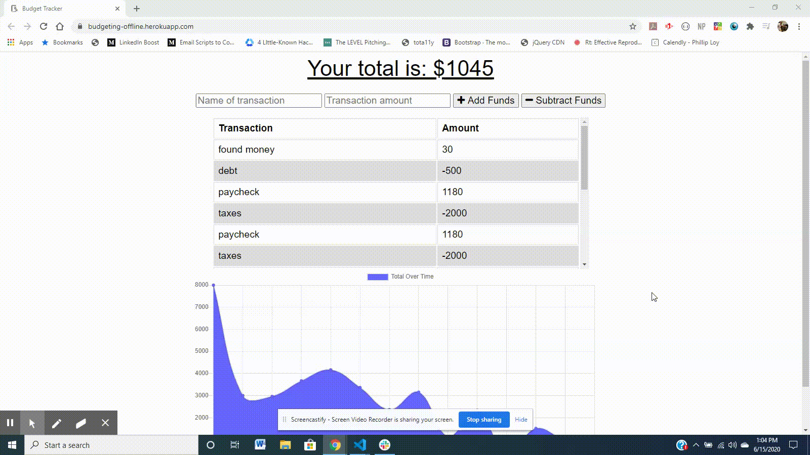

# Offline Budget

## <h2 id="link">Live Link</h2> https://budgeting-offline.herokuapp.com/

## <h2 id="description">Description</h2>
This an app that allows users to be able to add expenses and deposits to their budget with or without a connection. When entering transactions offline, they can populate the total when brought back online. 



## Table of Contents
* <a href="#link">Live Link</a> 
* <a href="#description">Description</a>
* <a href="#installation">Installation</a> 
* <a href="#tech">Technology Stack</a>
* <a href="#usage">Usage</a>
* <a href="#contributors">Contributors</a> 
* <a href="#contact">Contact</a>
* <a href="#tests">Tests</a>
    
## Installation
* Step 1. Git clone this link to your terminal: https://github.com/jeverett93/offline-budget.git
* Step 2. Navigate into the cloned repository.
* Step 3. Install the required dependencies using the following command:

    ```
    npm install
    ```
* Step 4. Run the application from the command line with following command:

    ```
    node server.js
    ```
## <h2 id="tech">Technology Stack</h2>
Node.Js, JavaScript, jQuery, GIT, GitHub, HTML, CSS, Bootstrap, Heroku, Express, Mongoose, Morgan, Service Worker, Web Manifest

## <h2 id="usage">Usage</h2>

```
AS AN avid traveller
I WANT to be able to track my withdrawals and deposits with or without a data/internet connection
SO THAT my account balance is accurate when I am traveling
```
    
## <h2 id="contributors">Contributors</h2>
[github.com/jeverett93](github.com/jeverett93)
    
## <h2 id="contact">Contact</h2>
* #### Name: Joshua Everett
* #### Portfolio: [jeverett.github.io](jeverett.github.io)
* #### Email: josheverett93@gmail.com
* #### LinkedIn: [https://www.linkedin.com/in/joshua-everett-087a4649/](https://www.linkedin.com/in/joshua-everett-087a4649/)

## <h2 id="tests">Tests</h2>
To test:

```
npm run test
```